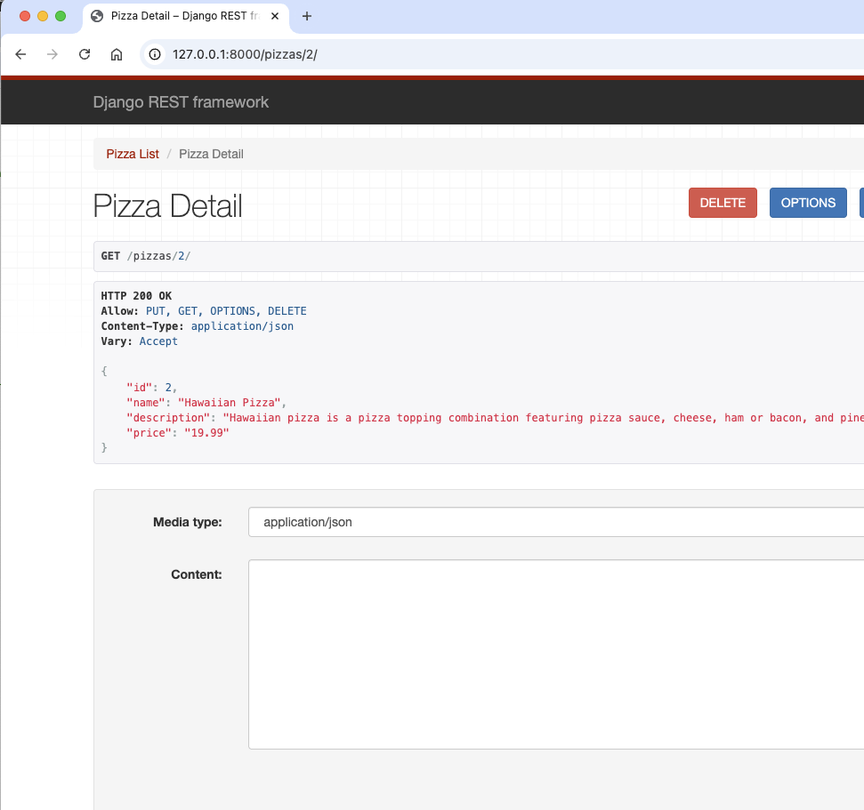

# 🍕 Pizza Ordering System (Tkinter + Django REST API)

This is a food ordering system built using Tkinter for the frontend and Django REST Framework for the backend. It allows users to browse available pizzas and place orderd

🧠 Project Overview

🛠️ Installation & Setup

♻️ For New Clones or Pulls:

# Clone the repository

git clone https://github.com/krys-dm/SDEV_220_Final_Project_PySquad.git
cd SDEV_220_Final_Project_PySquad

# Create and activate a virtual environment

python -m venv .venv
source .venv/bin/activate # On macOS/Linux

# OR

.venv\Scripts\activate # On Windows

# Install dependencies

pip install -r requirements.txt

🚀 Running the Application

🔧 Start the Backend Server (Django)

python manage.py runserver

Visit:

🔐 Admin Panel: http://127.0.0.1:8000/admin/

Username: pysquad

Password: 12345

Email:pysquad@gmail.com

📦 API Route - All Pizzas:http://127.0.0.1:8000/pizzas/

🖥️ Run the Frontend (Tkinter)

python "food ordering system.py"

📸 Screenshots

Admin Login

Running Terminals

Working API

Fetch Functionality

API Item Display

SIDE NOTES:

🧾 Order Model (Think: Receipt)

The Order model stores the core information for each customer transaction:

customer_name — Who placed the order

customer_address — Where it should be delivered

created_at — Timestamp of order

is_delivered — Status of delivery

🍕 OrderItem Model (Think: Line Items)

Each OrderItem represents a pizza in the order:

pizza — The specific pizza (linked to the Pizza model)

quantity — Quantity of that pizza

order — Associated order (linked to the Order model)
